# App 完整流程

> **已归档（2026-07-27，project-v1）**：本文属于全量文档快照的一部分，不再作为现行权威。见 [归档说明](../README.md)。重构请写到 `docs/`。

> 本文是 Gleem App 流程的逻辑事实源。Lunacy 可编辑图和 PDF 必须与本文保持一致。

视觉交付：

- [Lunacy 可编辑源文件](Gleem-App-Flows.free)
- [PDF 快速预览](Gleem-App-Flows.pdf)

## 1. 目标与原则

流程设计服务于一个核心体验：

> 用户完成必要设置后，不需要持续管理 App；再次打开时，一眼确认状态即可离开。

- 首次设置尽量短，先让免费 Safari Protection 生效。
- **Safari Protection 授权是进入 Home 的门禁**；未完成不得进入主页，不提供稍后完成。
- 不用功能轮播、统计 Dashboard、连续弹窗或通知权限制造负担。
- 正常状态使用 `All Quiet`，只在确实需要用户处理时显示 `One Quick Step`。
- 同时存在多个问题时，首页只展示一个最高优先级修复动作。
- 内置规则立即保护，线上规则异步更新，不因普通网络失败阻断用户。
- 免费 Safari Protection 与 Pro App Protection 独立，暂停或故障不互相拖累。
- TestFlight、Pro 技术验证和正式版放在同一规划中，用阶段标签区分。
- 用户侧合并技术细节，系统内部仍保留独立状态、校验和回滚。

## 2. 阶段与泳道

| 标签 | 阶段 | 用户可见结果 |
| --- | --- | --- |
| `A` | 两周 TestFlight | 免费 Safari Protection、Enhanced Protection、规则更新、反馈、Pro Preview |
| `B` | Pro 技术验证 | URL Filter/PIR、StoreKit Sandbox、App Protection 设置与故障恢复 |
| `C` | 正式商业版 | 真实年订阅、7 天试用、Family Sharing、正式支持 |

| 泳道 | 职责 |
| --- | --- |
| User | 做出明确选择和完成系统授权 |
| Gleem App | 状态编排、界面、规则更新、订阅状态和恢复动作 |
| Safari / Extensions | Content Blocker、Enhanced Protection、当前网站操作 |
| Rules Service | Manifest、签名规则包、版本与回滚 |
| StoreKit / App Store | 试用资格、购买、续费、退款、Family Sharing |
| App Protection | Pro 跨 App URL Filter 与 PIR |

## 3. 总流程

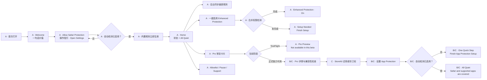

总流程不代表所有页面同时出现。首页只显示当前状态、一个必要动作、Pro 状态卡和低频入口。

**门禁：** 免费 Safari Protection 未完成授权前不得进入 Home。没有 `Finish Later` / `I'll do this later`；未启用时留在 A2 操作指引页，否则后续功能没有意义。

## 4. 首次启动与 Safari Protection

### 4.1 屏结构（FLOW A）

| 画板 | 名称 | 用户动作 |
| --- | --- | --- |
| A1 | Welcome | 仅主按钮 `Set Up Safari Protection`（无 `Privacy` 次级入口） |
| A2 | Allow Safari Protection | 详细操作指引 + `Open Settings`（可深链到 Extensions） |

授权成功后**不经过独立成功页**，直接进入 **Home**，首页状态为 `All Quiet`（见 §5）。

Welcome 只包含：

- `A quieter, cleaner Safari.`
- Safari、YouTube/X 和隐私三个简短价值点。
- `Set Up Safari Protection` 主按钮。

Privacy 说明页不放在 onboarding：从 Home → **Settings & Support → Privacy** 进入（见 §13 信息架构）。

不增加三至四页功能轮播。

A2 是唯一的授权操作页：首次进入与「返回后仍未开启」共用同一指引，不切换布局、不展示独立「仍未开启」或「All Quiet 成功」中间页。

A2 步骤文案（对用户说清路径，参考系统设置真实结构）：

| 步骤 | 标题 | 说明 |
| --- | --- | --- |
| 1 | Open the Settings app | Tap Apps → Safari → Extensions |
| 2 | Enable Stillwall | Tap Stillwall, turn the switch on, then choose Allow for All Websites |
| 3 | Return to Stillwall | We'll check automatically when you come back |

- 主按钮：`Open Settings`（实现上可用 Shortcuts 深链；文案不暴露 Shortcuts）。
- 页脚隐私：`Filtering happens on this iPhone. Nothing is uploaded to Stillwall servers.`（不宣称「无法读取页面」——Content Blocker 可在本机处理 URL；强调数据留在本机、不上传服务器）。
- 不提供 `I'll do this later`。

### 4.2 流程

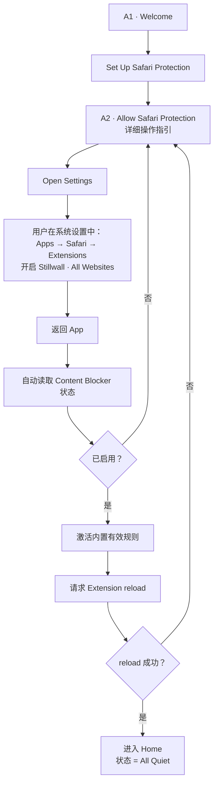

硬性规则：

- **必须完成 Safari Protection 授权后才能进入 Home。**
- 不提供 `I'll do this later` / `Finish Later` 跳过首次授权。
- 用户从设置返回时自动检测；**未开启则仍显示 A2**；**已开启则直接进入 Home（All Quiet 态）**，不插 onboarding 成功页。
- 杀进程或冷启动时，若仍未授权，继续停在 A2，不进入 Home。

App 每次启动或回到前台时重新读取保护事实：

- Content Blocker 是否启用。
- 是否有通过校验的有效规则。
- 是否暂停。
- Enhanced Protection 合并权限是否完整。
- Pro entitlement 和 App Protection 状态。
- App 与规则版本是否兼容。

不为 Extension 被关闭单独申请通知权限。只有用户再次打开 App 或使用扩展入口时更新可见状态。

## 5. 首页状态编排

| 状态 | 使用条件 | 示例副文案 |
| --- | --- | --- |
| `All Quiet` | 当前承诺范围内保护有效 | `Ads and trackers are being blocked in Safari.` |
| `One Quick Step` | 存在一个用户可修复的最高优先级问题 | `Turn on Safari Protection to finish setup.` |
| `Paused` | 当前范围被用户主动暂停 | `Safari protection resumes at 3:45 PM.` |

Pro 正常时，副文案变为：

`Ads and trackers are being blocked in Safari and supported apps.`

不使用 `Protected Everywhere`，避免暗示所有 App、所有广告都能被拦截。

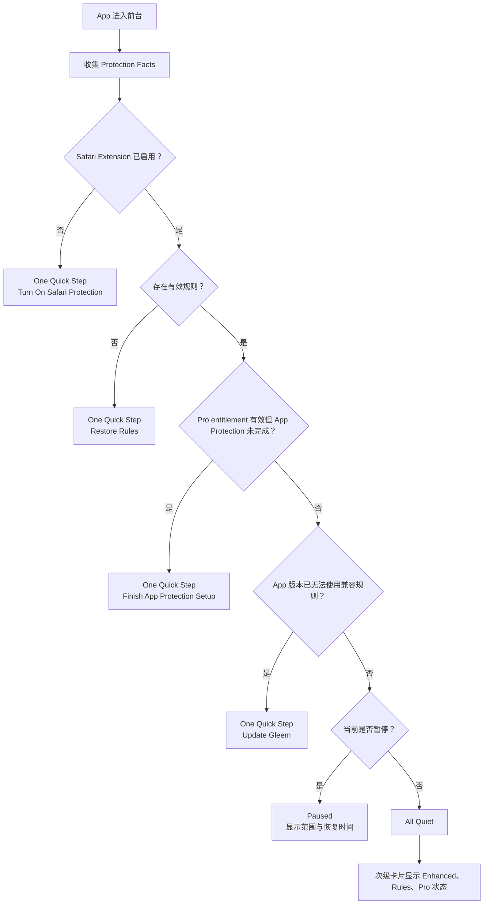

Enhanced Protection 未启用不是首页故障，只在次级卡片显示 `Enhance YouTube & X`。

首页结构：

```text
Home
├── Primary Status
│   ├── All Quiet
│   ├── One Quick Step + 唯一主按钮
│   └── Paused + Resume Now
├── Pro / App Protection Card
├── Enhanced Protection
├── Rules
├── Allowlist
└── Settings & Support
```

不使用底部 Tab Bar。低频任务通过 `NavigationStack` 进入二级页面。

## 6. Enhanced Protection

用户只看到一个能力，不需要理解 YouTube 与 X 的独立权限。

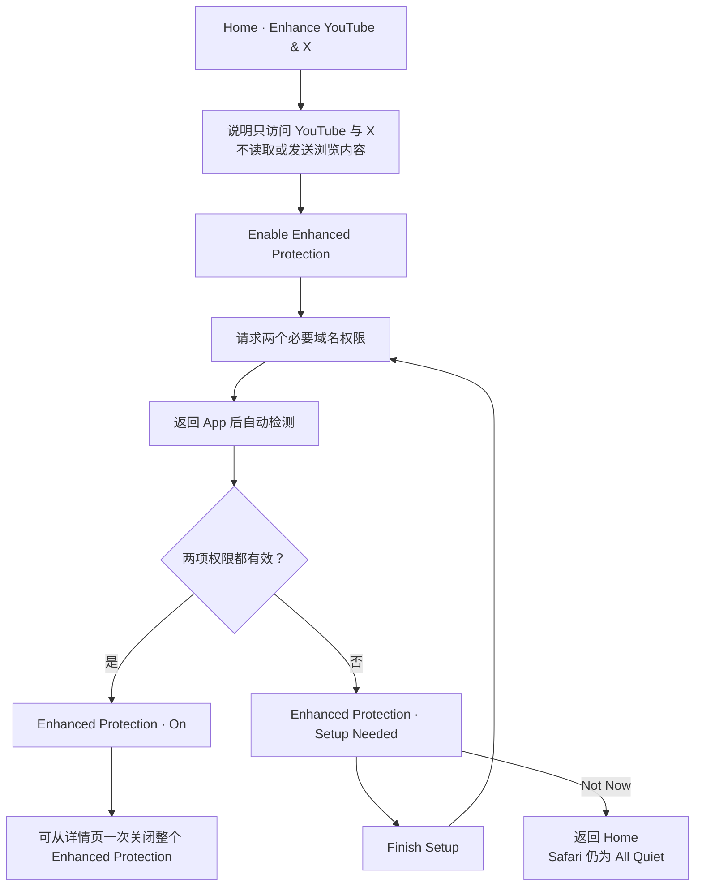

- 用户侧不显示部分开启。
- 任一必要权限缺失，合并状态均为 `Setup Needed`。
- 关闭时一次关闭整个 Enhanced Protection。
- 未开启不影响免费 Safari Protection 的健康状态。
- YouTube/X 页面结构未知时 fail open，不阻断内容。

## 7. 规则自动更新与回滚

触发条件：

- App 启动或进入前台，且超过检查间隔。
- `BGAppRefreshTask` 尽力执行。
- 用户在 Rules 详情页点击 `Check Now`。

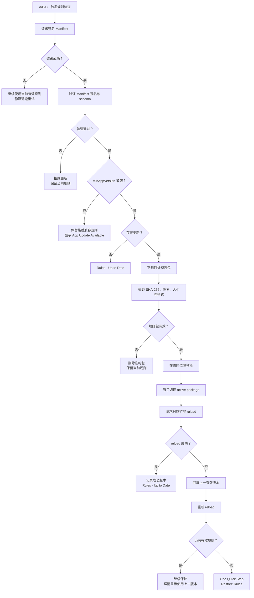

普通失败不弹窗、不发通知、不显示技术错误。Safari、Enhanced 和 Pro 规则可以内部独立更新，首页只显示统一 `Rules` 状态。

## 8. Pro Preview、试用与年订阅

### 8.1 首页卡片

| 情况 | 卡片 |
| --- | --- |
| TestFlight | `Pro Preview · Protect ads in more apps` |
| 未订阅 | `Protect ads in more apps · Explore Pro` |
| 试用且已启用 | `App Protection · On · Trial ends …` |
| 已订阅 | `App Protection · On` |
| 已购买未设置 | `Finish App Protection Setup` |
| 已暂停 | `App Protection · Paused` |
| 已过期 | `App Protection · Off · Restart Pro` |

卡片始终位于首页第二视觉层级。购买后原位转为状态与管理入口，不继续做推广。

### 8.2 TestFlight 分支

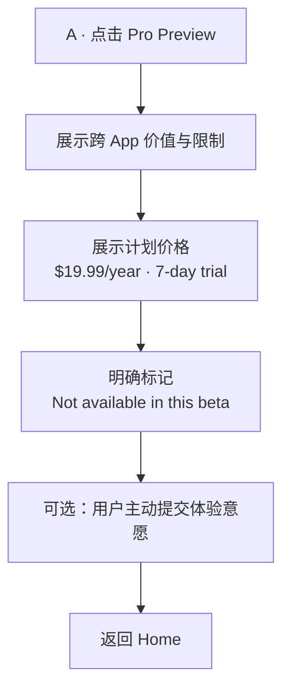

TestFlight 不显示假的购买面板、试用成功或 App Protection 已启用状态。

### 8.3 正式购买与设置

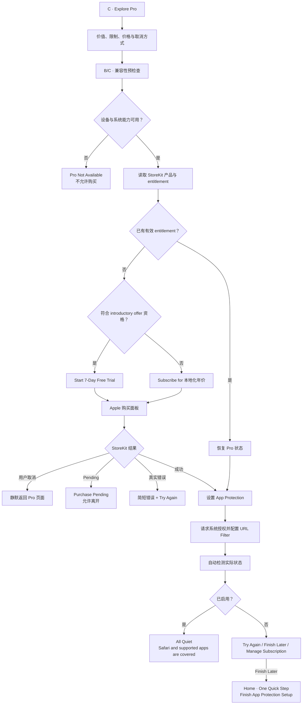

- 产品只有一个年订阅。
- 首发美国区目标价 `$19.99/year`，界面使用 StoreKit 本地化价格。
- 所有符合 Apple 资格的用户从 7 天免费试用开始。
- 已使用过同一订阅组 introductory offer 的用户直接显示年订阅。
- 不申请通知权限提醒试用结束。
- 试用结束日、续费日、价格和 `Manage Subscription` 始终可查看。
- 购买成功不等于 App Protection 已启用，必须完成系统状态检测。

## 9. Entitlement 恢复、变化与到期

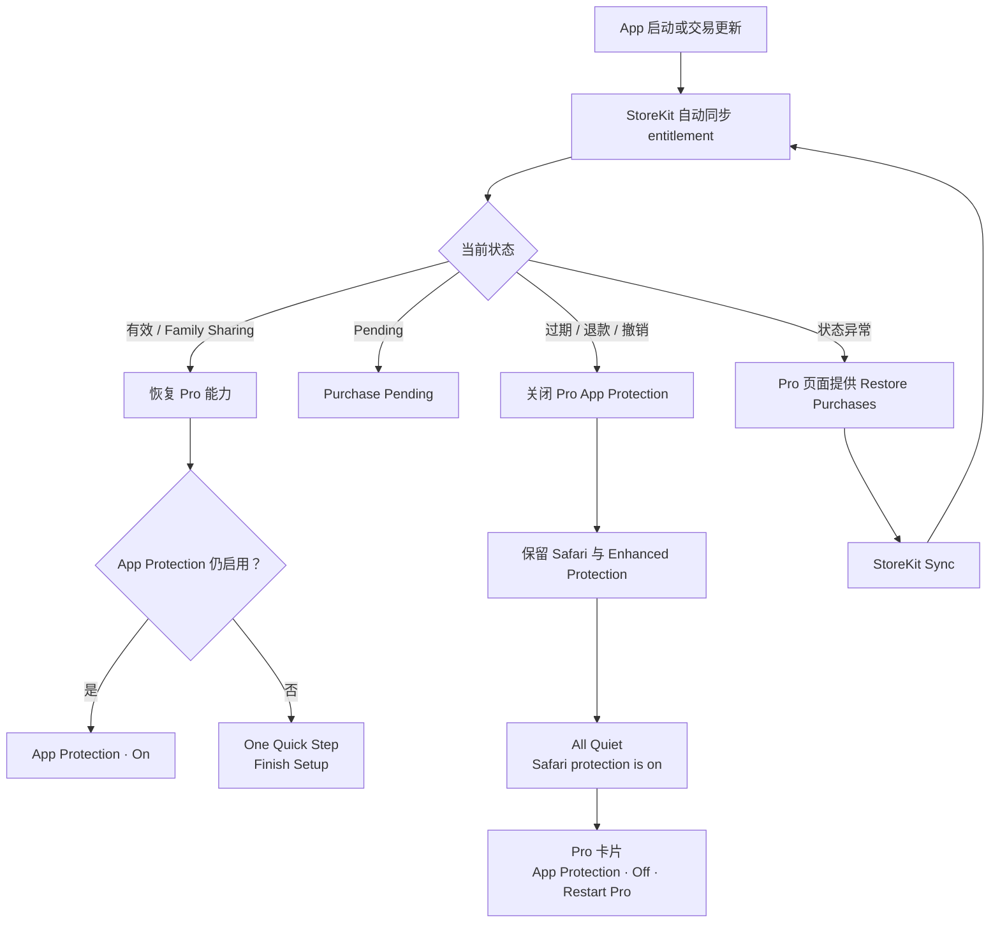

- 自动同步是主路径，`Restore Purchases` 只是故障恢复入口。
- 到期不弹出付费墙，不把首页变成警告状态。
- 用户主动点击 `Restart Pro` 后才重新进入购买流程。
- 取消订阅由 Apple 管理，App 提供 `Manage Subscription` 跳转。

## 10. Allowlist 与暂停

### 10.1 当前网站放行

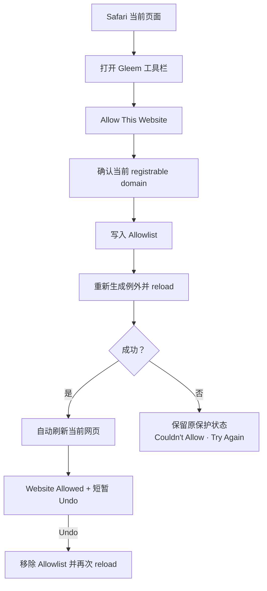

网站只能从 Safari 当前页面加入 Allowlist。主 App 只负责查看、搜索、删除和恢复全部网站保护，不提供手动输入域名或 URL path 级规则。

### 10.2 暂停范围

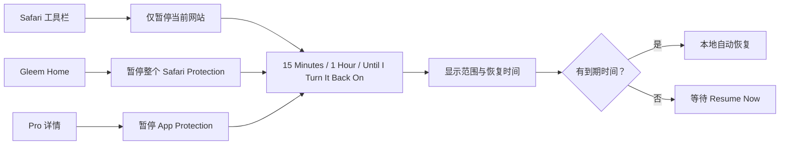

暂停 Safari 不关闭 Pro；暂停 Pro 不关闭 Safari。

## 11. Missed Ad 与 Site Broken

### 11.1 Missed Ad

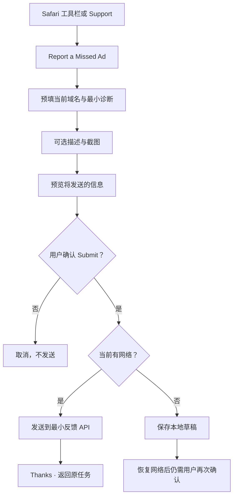

### 11.2 Site Broken

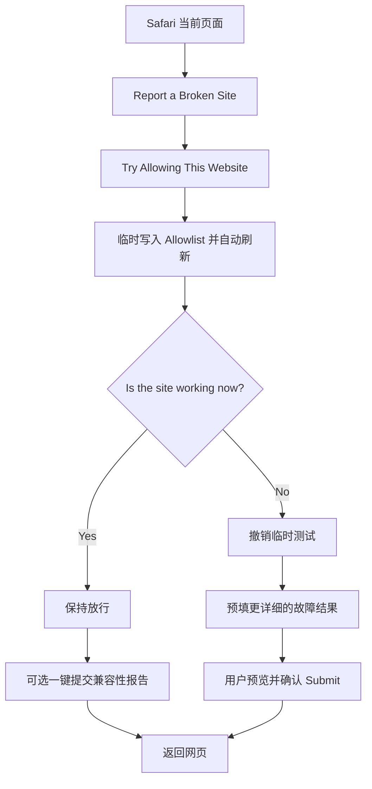

默认报告可以包含当前域名、App/系统版本、规则版本、扩展合并状态和当前站点的暂停/放行状态。

默认不包含完整 URL、浏览历史、Cookie、账号、页面正文、请求内容或未经用户选择的截图。

反馈通过 App 内最小 API 提交，不依赖系统 Mail，不要求账号，不在离线恢复后静默发送。

## 12. Pro 故障与 fail open

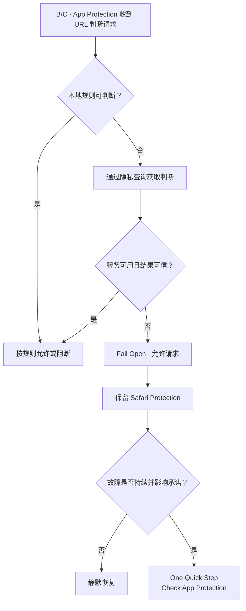

广告拦截故障不能导致其他 App 断网。短暂服务异常不打扰用户；持续故障才进入首页单一修复动作。

## 13. 页面跳转

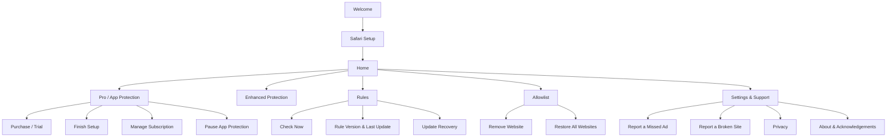

所有二级页面都使用普通返回，不形成深层嵌套。用户完成设置或恢复动作后返回 Home，并重新计算状态。

## 14. 流程对应的开发任务

| 工作流 | App | Extension | Backend / Service | StoreKit / Apple |
| --- | --- | --- | --- | --- |
| 首次设置 | Welcome、状态检测、续接 | Content Blocker 状态与 reload | 无 | 系统设置 |
| Enhanced | 合并开关与状态 | YouTube/X 权限与脚本 | 规则模块开关 | Safari 权限 |
| 规则更新 | Manifest、下载、校验、回滚 | reload、读取 active package | 签名 Manifest、CDN、回滚 | BG task |
| Pro | 卡片、兼容性、状态编排 | 免费能力保持独立 | PIR 数据与服务 | StoreKit、URL Filter entitlement |
| Allowlist | 管理列表 | 当前域名、例外、刷新 | 无 | 无 |
| Pause | 范围和到期时间 | 每次读取并自动恢复 | 无 | 无 |
| 反馈 | 预填、预览、草稿、提交 | 当前域名入口 | 最小反馈 API | 无 |
| 订阅生命周期 | entitlement、恢复、到期 UI | 无 | 可选服务状态 | 购买、续费、退款、Family Sharing |

## 15. 验收标准

- 首次用户无需阅读轮播即可开始 Safari 设置。
- 从系统设置返回后自动检测，不要求额外点击 `Done`。
- 未完成设置可以离开引导，但首页不显示虚假健康状态。
- 有有效内置规则时，首次使用不等待网络。
- 正常首页没有必须点击的动作，用户一眼即可离开。
- Enhanced 只有一个用户侧开关和一个合并状态。
- Pro 卡片明显但不自动打开付费墙。
- 购买取消不显示失败；购买成功仍需检测 App Protection。
- Pro 到期不影响免费 Safari Protection。
- 普通规则更新失败不弹窗，损坏规则不会覆盖有效版本。
- Safari 当前网站放行后自动刷新，并提供 Undo。
- Site Broken 先恢复网页，再收集反馈。
- 反馈提交前可查看发送内容，离线恢复后不自动发送。
- Safari、当前网站和 Pro 的暂停范围不会互相混淆。
- 所有用户可见状态均能由实际系统事实推导。
