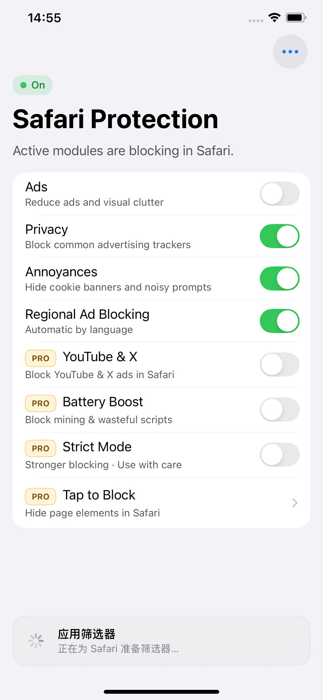
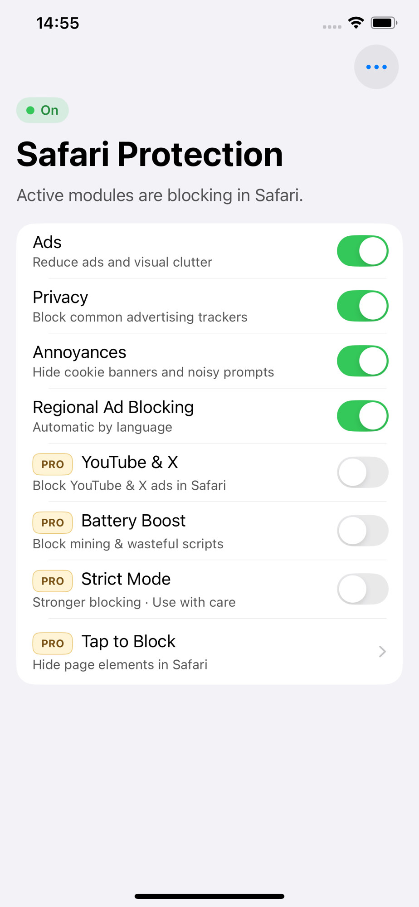
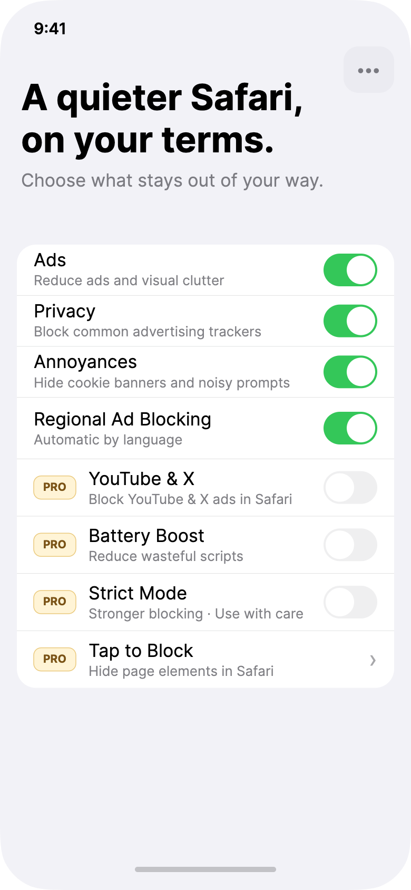

# Issue 001：Home 顶部改为中性价值文案（去掉 On / Safari Protection 状态区）

| 字段 | 内容 |
|------|------|
| 状态 | open |
| 优先级 | P0（与已确认产品决策 D-315 / D-316 冲突） |
| 类型 | ui / copy / behavior |
| 影响范围 | 主 App · Home |
| 相关文档 | `docs/product/product-charter.md` §7.3；`docs/design/screens.md` S03；`docs/decisions/decision-log.md` D-315、D-316 |
| 创建日期 | 2026-07-31 |

## 问题现象

实机 Home 顶部仍为「保护状态」叙事：

- 绿色 **On** pill  
- 大标题 **Safari Protection**  
- 副文案 **Active modules are blocking in Safari.**

这与 v1 已确认决策冲突：Home **不做** On/Off 状态区、**不做**保护状态 pill、**不**用状态驱动标题。





## 期望结果

与设计稿 / 产品总纲领一致：

1. **移除**顶部状态 pill（On / Off 等）。  
2. 标题与副文案改为固定中性价值文案（**不**随类别开关变化）：

```text
A quieter Safari, on your terms.
Choose what stays out of your way.
```

3. 类别开关列表、PRO 行、More（`…`）保持现有能力与顺序，无需因本 issue 改业务逻辑。  
4. 全部类别 Off 时，**仍显示同一套**顶部文案与列表布局（仅拦截不生效；诚实状态由 Safari 扩展顶栏表达，不在此页做 On/Off 变体）。

设计参考：



## 修改说明（给开发）

### UI

- 删除 Home header 中的 status pill / 保护状态组件及其绑定的 `isProtected` / `globalOn` 一类展示逻辑。  
- Value Hero 使用上述两行固定英文文案；排版对齐 `docs/design/design-system.md` §7.1（Value Hero）。  
- **不要**把「全局总开关」加回来（D-315）。  
- **不要**再维护 Home On / Home Off 两套页面或标题变体（D-316）。

### 文案

| 位置 | 使用 |
|------|------|
| 主标题 | `A quieter Safari, on your terms.` |
| 副文案 | `Choose what stays out of your way.` |
| 删除 | `Safari Protection`、`Active modules are blocking in Safari.`、状态 pill `On`/`Off` |

### 勿误改

- 类别行文案、PRO badge、Tap to Block chevron 行  
- 右上角 More  
- 规则编译进度条（见 issue **002**）  
- Setup 门禁与扩展状态检测（丢失授权仍应模态拉回 Setup，但 **Home 成功页本身不展示保护 pill**）

### 深色模式 / 动态字体

- 中性文案需同时检查 Dark 与 Large Type（设计导出有对应画板可参考）。

## 验收标准

- [ ] Home 顶部无 On/Off（或其它保护状态）pill  
- [ ] 主副文案为固定中性句，切换任意类别开关后文案不变  
- [ ] 无「Safari Protection」作为 Home 主标题  
- [ ] 全部类别 Off 时页面结构与顶部文案不变  
- [ ] 与 `screens.md` S03 / charter §7.3 一致  

## 附件

| 文件 | 说明 |
|------|------|
| `before/home-status-pill.jpg` | 实机：状态 pill + Safari Protection（Ads 关） |
| `before/home-ads-on.jpg` | 实机：Ads 开，状态区仍在 |
| `before/home-status-pill-hires.png` | 同源高分辨率截图 |
| `after/home-design-target.png` | Hi-fi 设计目标（phone-preview `03-Home`） |
