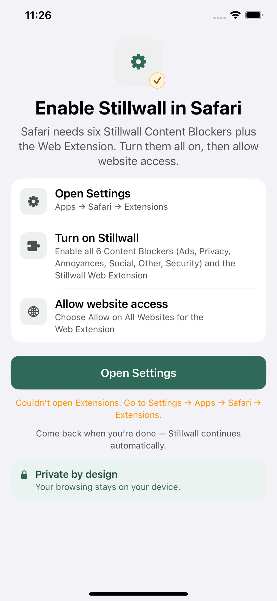
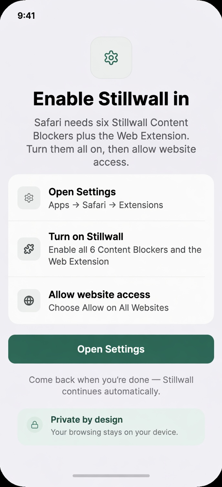

# Issue 003：Setup「Open Settings」深链失败体验 + 三步说明对齐文档

| 字段 | 内容 |
|------|------|
| 状态 | open（**文案/设计目标已更新**；深链逻辑待主 App 源码） |
| 优先级 | P1 |
| 类型 | behavior / copy / docs-sync |
| 影响范围 | 主 App · Setup（Safari 授权引导） |
| 相关文档 | `docs/design/screens.md` S02（已改为三步）；`docs/product/product-charter.md` §7.2 |
| 创建日期 | 2026-07-31 |

## 问题现象

Setup 页点击主按钮 **Open Settings** 后，出现橙色错误：

> Couldn't open Extensions. Go to Settings → Apps → Safari → Extensions.

深链到系统「扩展」页在部分 iOS 版本/环境下会失败，属常见平台限制。当前实现已给出手动路径，但：

1. 失败反馈偏「报错」感，首次启用压力大。  
2. 主按钮仍是 Open Settings，用户可能反复点、反复看到同一错误。  
3. 产品文档曾写「两步」，实现已是更清晰的 **三步**（Open Settings → 开启 6 个 Content Blockers + Web Extension → Allow website access），文档需与实现一致（文档侧已同步，见本仓库 `screens.md`）。



设计参考（成功态布局，非错误态）：



## 期望结果

### 深链策略（最佳实践）

1. 点击 **Open Settings** 时：  
   - **优先**尝试打开最深可用 URL（Extensions / Safari 相关）。  
   - 失败则 fallback：`UIApplication.openSettingsURLString`（App 自身设置）或仅提示手动路径——**以能减少挫败为准**，不要空操作。  
2. 用户取消或系统无法打开时：  
   - **不要**用刺眼「错误红/永久失败」语气。  
   - 使用**指导性**文案（info / secondary），例如：

```text
If Settings didn’t open, go to:
Settings → Apps → Safari → Extensions
```

   或保留现有路径说明，但样式从「error」改为「hint」（次要灰/品牌色，非告警橙红，除非多次失败）。

3. 主按钮在首次失败后可保持 **Open Settings**（继续尝试），同时路径说明常驻可见，避免用户不知道下一步。  
4. 文案继续强调：**6 个 Content Blockers + Stillwall Web Extension** 全开，且 Web Extension **Allow All Websites**（与现有步骤 2/3 一致）。

### 三步结构（以现实现为准）

| # | 标题 | 要点 |
|---|------|------|
| 1 | Open Settings | Apps → Safari → Extensions |
| 2 | Turn on Stillwall | 全部 6 个 Content Blockers + Web Extension |
| 3 | Allow website access | Web Extension → Allow All Websites |

完成检测逻辑不变：未完成不得进 Home。

## 修改说明（给开发）

1. 梳理当前 open URL 列表与 iOS 版本兼容；失败时 fallback + 非 error 样式 hint。  
2. 区分：  
   - `user cancelled` / 无法打开 → hint  
   - 真异常（极少）→ 可短 toast，仍附手动路径  
3. 可选增强（P2，非必须）：检测权限已满足时自动 dismiss Setup / 进入 Home（若已有则保持）。  
4. 勿弱化「必须全开」的说明；误开不全会导致「以为开了但不拦」。

### 产品文档

- `docs/design/screens.md` S02 已改为三步结构（本 issue 配套）。  
- 实现与文档冲突时以 **三步 + 门禁** 为准。

### Hallmark 增补（设计稿与实现共同问题）

#### 1. 文案诚实度（Hi-fi 也偏弱）

| 位置 | 现状问题 | 期望（en） |
|------|----------|------------|
| 页副文案 | 设计稿 *Turn on both extensions…* 像只有 2 个扩展 | 点明 **Content Blockers + Web Extension**（与步骤 2 的 6 个 CB 一致） |
| 步骤 2 副文案 | 设计：*Enable both Stillwall extensions*；实现已更细 | 统一为列出 **6 Content Blockers + Web Extension**（可短写：`Enable all 6 Content Blockers and the Web Extension`） |
| 顶 emblem 金勾 | 齿轮 + 金色 check **始终出现**，易读成「已完成」 | **未完成授权时不要用「完成」角标**；完成后再出现 check，或去掉常驻 check，改用中性 settings 图标 |

建议页级副文案：

```text
Safari needs six Stillwall Content Blockers plus the Web Extension.
Turn them all on, then allow website access.
```

（实现截图已接近此句，**以诚实版为准**，回写设计稿时同步。）

#### 2. 失败 hint 的视觉

| 项 | 规范 |
|----|------|
| 色 | `textSecondary` 或弱品牌色；**勿**默认用告警橙/红（除非连续失败 2+ 次可略强调） |
| 位 | 主按钮与 “Come back when you’re done” 之间；或替换该行下方的错误位 |
| 字重 | Regular，多行可左对齐，路径用 `→` 保持与步骤副文案一致 |
| 与安心条 | 底部 `Private by design` 条保留；失败 hint **不要**挤掉安心条 |

#### 3. 与全局人格

Setup 是全 App **唯一允许略「任务感」** 的屏，但仍须：单主 CTA、森绿按钮、无恐吓、无假进度。深链失败时语气是「帮你指路」，不是「你做错了」。

## 验收标准

- [ ] 深链失败时用户仍能靠页面文案完成手动设置  
- [ ] 失败提示不表现为刺眼硬错误（或仅短暂出现后变为常驻 hint）  
- [ ] 三步说明完整且诚实：Settings、**6 CB** + Web Extension、Allow All Websites  
- [ ] 未完成时顶图**无**「已完成」金勾误导（或仅完成态显示）  
- [ ] 未完成授权不能进入 Home  
- [ ] 英文 UI；副文案与步骤 2 不再写含糊的 “both extensions”  

## 附件

| 文件 | 说明 |
|------|------|
| `before/setup-open-settings-failed.jpg` | 实机：Open Settings 失败橙字 |
| `after/setup-design-target.png` | Hi-fi Setup 布局参考（成功态；文案以本 issue 诚实版为准） |
