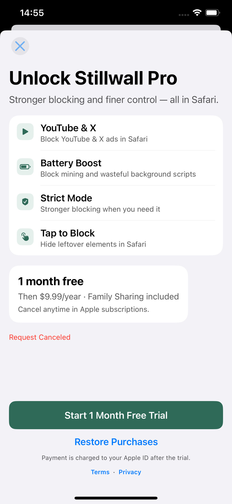
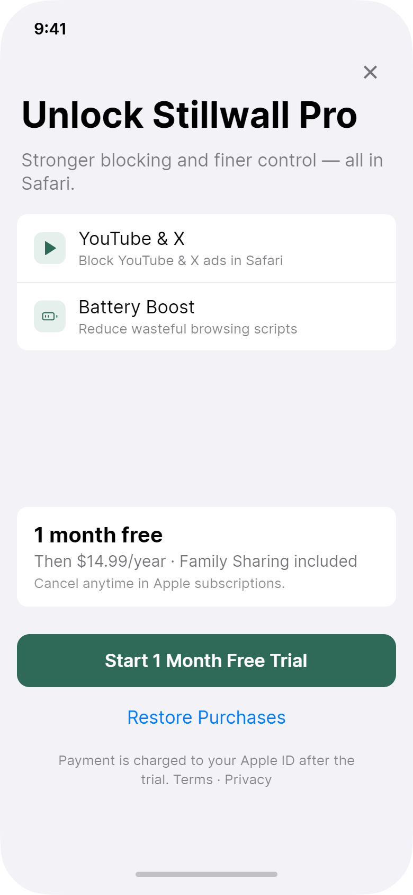

# Issue 004：Pro 定价对齐 $14.99 + 用户取消购买不展示 Request Canceled

| 字段 | 内容 |
|------|------|
| 状态 | open（**定价/取消 UX 规格已锁**；待 StoreKit 主 App + ASC） |
| 优先级 | P0（定价错误）/ P1（取消态文案） |
| 类型 | behavior / copy |
| 影响范围 | 主 App · Upgrade / Paywall · **任意**展示订阅错误状态的界面（含 **More**） |
| 相关文档 | `docs/product/product-charter.md` §4.1；`docs/design/screens.md` S08；`secondary-screens` More 禁止项 |
| 创建日期 | 2026-07-31 |
| 更新 | 2026-07-31：实机 More 上出现 Request Canceled → **全 App 禁显** |

## 问题现象

### 1. 价格与产品决策不一致

实机付费墙展示：

> 1 month free  
> Then **$9.99/year** · Family Sharing included  

产品总纲领与页面说明已锁定：

| 项 | v1 决策 |
|----|---------|
| 价格 | **$14.99 / 年** |
| 试用 | 1 个月 |
| 家庭共享 | 支持 |

### 2. 用户取消购买时露出 StoreKit 原始结果

红色文案 **Request Canceled**（用户关掉系统购买表时常见）。  
取消是正常行为，不应当作错误恐吓用户。

**实机还出现在 More 列表底部**（与付费墙无关的常驻红字）——见  
`issues/006-secondary-and-extension-hifi/before/more-status-request-canceled.png`。



设计参考（价格与布局目标）：



## 期望结果

### 定价

1. 付费墙展示与 **App Store Connect 年订阅** 一致为 **$14.99/year**（试用 1 个月）。  
2. 展示文案建议：

```text
1 month free
Then $14.99/year · Family Sharing included
Cancel anytime in Apple subscriptions.
```

3. 价格优先从 **StoreKit 2 Product** 本地化价格读取；若 ASC 产品仍是 $9.99，需在 **App Store Connect** 改为 $14.99（或替换为正确 product id），客户端不要长期硬编码错误价。  
4. 硬编码 fallback 仅用于 ASC 未返回时，且必须为 `$14.99`（或当前商店本地化等价），**不得**再用 `$9.99`。

### 取消 / 错误展示（**全 App**）

| StoreKit 结果 | UI |
|---------------|-----|
| 用户取消（`userCancelled` / 等效） | **静默**：不显示错误行；**清空**全局/页面 error state |
| 待处理 / 家长审批等 | 中性说明（英文），非红字「Request Canceled」 |
| 真失败（网络、不可用等） | **仅**在触发购买/Restore 的上下文 inline 友好英文；**禁止**把原文钉在 More 等无关页 |

**硬规则：** `Request Canceled` / `error.localizedDescription` **不得**出现在：

- Upgrade / Paywall  
- **More**  
- Home、Setup、Help、Feedback、About  
- 任何 toast 常驻失败条（取消类）

主按钮文案保持：**Start 1 Month Free Trial**；次要：**Restore Purchases**。  

**利益列表（D-317）：** 仅 **YouTube & X in Safari**、**Battery Boost**——**不要** Strict Mode / Tap to Block。

## 修改说明（给开发）

1. **核对**订阅 product id 与 ASC 标价；与 charter §4.1 对齐。  
2. 购买 / Restore 流程 `catch` / result 分支：  
   - cancel → `return` / **clear 全部订阅相关 error UI state**  
   - success → unlock Pro UI  
   - other → localized friendly message（仅当前操作上下文）  
3. 删除任何直接展示 `error.localizedDescription` 且未过滤 cancel 的路径（含 More 列表底部绑定）。  
4. Terms / Privacy 链接保持可用。  
5. More 列表结构见 **006**（本 issue 只负责错误态，不重写 More IA）。

### 勿误改

- 免费能力与 Pro 权益边界  
- Family Sharing 说明（保留）  
- 非首次进 Home 门禁（paywall 不是进 App 条件）

### Hallmark 增补（付费墙调性）

Upgrade 在 Hi-fi 中已是全 App **最干净的一屏**：利益列表 + Offer 卡 + 单主 CTA + 系统蓝 Restore。实现不要破坏这份克制。

| 项 | 规范 |
|----|------|
| 错误展示 | **仅**真失败时，在 CTA **下方** inline 一行可读英文（design-system §7.8）；字色可用语义红，但句子是人话，不是 StoreKit 原文 |
| 取消 | 清空 error state；无横幅、无 toast |
| 处理中 | CTA → `Processing…` + disabled（§7.8） |
| Restore | 保持系统蓝链接，不与主 CTA 抢绿色 |
| 利益行图标 | 小圆角井 + 品牌软绿底（对齐 Hi-fi）；与 Home 的 PRO 金徽标职责分离——**墙内不必再贴 PRO badge** |
| 利益副文案 | 与 Home / Welcome 锁定表一致（见 **005**），避免 Battery/Tap 各页各写一版 |
| 法律行 | 小字 secondary；Terms · Privacy 可点 |

**品味红线：** 不要为提高转化加假倒计时、假「仅剩 N 席」、多计划比价表、全屏粒子。Stillwall 的 Pro 是「需要时更强」，不是「你不安全快付钱」。

## 验收标准

- [ ] 付费墙年价展示为 **$14.99**（或 StoreKit 返回的本地化 $14.99 等价），不再出现 $9.99（除非 ASC 未改且需先改商店——此时阻塞上架）  
- [ ] 用户取消系统购买表后，**Upgrade 与 More 等任意页**均**无**红色 Request Canceled  
- [ ] 工程搜索无用户可见 `Request Canceled` 常驻绑定  
- [ ] 真实购买失败仍有友好英文提示（inline，非原始 error 字符串）  
- [ ] 试用 CTA 与 Restore 行为正常；Processing 态可用  
- [ ] 布局/层级接近 Hi-fi：利益卡 → Offer → 单主 CTA（利益仅两行）  
- [ ] 与 charter §4.1、screens S08、**006** More 禁止项一致  

## 附件

| 文件 | 说明 |
|------|------|
| `before/paywall-request-canceled.jpg` | 实机：$9.99 + Request Canceled |
| `after/upgrade-design-target.png` | Hi-fi Upgrade 参考 |
