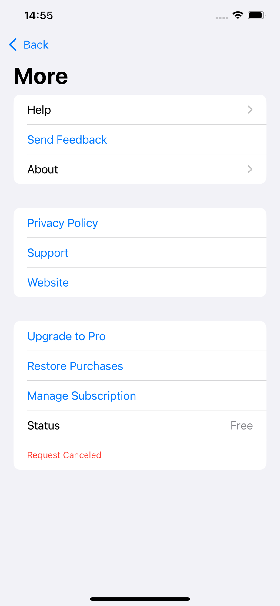

# Issue 006：次级页（More 等）与 Safari 扩展 UI

| 字段 | 内容 |
|------|------|
| 状态 | **open** |
| 优先级 | **P1** |
| 类型 | ui / copy / behavior |
| 影响范围 | More · About · Feedback · Safari 扩展 popup（Help 见 **009**；**无** Tap · D-317） |
| 相关文档 | `docs/design/secondary-screens.md`；`docs/design/safari-extension.md`；`docs/engineering/ui-copy-en.md` |
| 创建日期 | 2026-07-31 |
| 更新 | 2026-07-31：实机 More 审查后**钉死锁定表与禁止项** |

## 问题现象

### More（实机 · 2026-07-31）

与 `secondary-screens` / 线框目标严重不符：

| 实机 | 问题 |
|------|------|
| **Send Feedback**（蓝字链样式） | 应为行名 **Feedback** + chevron 进 S09 |
| **Support** 行 | 规格 **无** 此行（Support 走站外 URL，不在 More 列表） |
| **Upgrade to Pro** | Pro 从 Home Pro 行进入；More **无**升级入口 |
| **Status · Free** | 调试/权益展示，规格 **禁止** |
| 红字 **Request Canceled** | StoreKit 取消残留；见 **004**（全 App 禁显） |
| 多组分隔、蓝链堆叠 | 偏离 quiet Settings 列表人格 |

### 其他

| 面 | 现状 |
|----|------|
| Help / Feedback / About | 实现不齐或风格漂移 |
| 扩展 popup | 须 **2 项**（D-317）；无 Tap |
| S05 Tap | **v1 不做** |

## 期望结果

### S06 More — 锁定行表（开发必须按此）

权威：[`secondary-screens.md` §2](../../docs/design/secondary-screens.md) · [`ui-copy-en.md` §6](../../docs/engineering/ui-copy-en.md)

| 顺序 | 行标题（en） | 控件 | 行为 |
|------|--------------|------|------|
| 1 | `Help` | Chevron | → S07 |
| 2 | `Feedback` | Chevron | → S09（**不是** `Send Feedback` 蓝链） |
| 3 | `About` | Chevron | → S10 |
| 4 | `Privacy Policy` | Chevron 或系统外链样式 | → yilinglabs.com/privacy |
| 5 | `Website` | 同上 | → yilinglabs.com |
| 6 | `Restore Purchases` | 行 / 链 | StoreKit restore；结果 **inline/toast 英文**，不落红字常驻 |
| 7 | `Manage Subscription` | 行 | 系统订阅管理 |

可选：1–3 一组，4–5 一组，6–7 一组（最多两组/三组，勿再加调试组）。

### 禁止（More 及次级页）

| 禁止 | 说明 |
|------|------|
| `Support` 行 | 不在 v1 More IA |
| `Upgrade to Pro` / 任何 More 内付费主推入口 | Pro 仅 Home Pro 行 / 既有 Upgrade 流 |
| `Status` / `Free` / `Pro` 权益状态行 | 非 Settings 人格 |
| 常驻 `Request Canceled` 或任何 StoreKit `localizedDescription` | 与 **004** 一致 |
| 账号、Allowed Sites、调试开关 | 总纲领不做 |
| Tap to Block 入口 | D-317 |

### 其他屏

| 屏 | 必须 |
|----|------|
| **S09 Feedback** | 类型 · 描述 · 可选域名 · **发送前预览**；主按钮 `Send`（森绿） |
| **S10 About** | 版本 · 定位句 · Acknowledgements · Mac coming soon 可选 |
| **SE01 popup** | **仅 2 项**：Pause/Resume · Report；无 IAP、无 Tap |
| **S05** | **不实现**（**011**） |
| **Help** | **009** |

视觉：`surfaceGrouped` + r18 卡 + 系统列表字色；主 CTA 仅 Feedback 发送等动作用森绿；外链可用系统蓝，但 **Feedback / Help / About 勿整行做成蓝按钮文字**。

## 修改说明（给开发）

1. 重写 More：删 Support、Upgrade to Pro、Status、Request Canceled；Feedback 用标准 NavigationLink 行。  
2. Restore / Manage：restore 取消或失败勿把原始错误钉在列表底部。  
3. 扩展 popup 跟 `safari-extension.md`（2 项）。  
4. 对稿：[`exports/secondary-preview/png/`](../../docs/design/exports/secondary-preview/png/)（S06 / SE01* 等）。

## 验收标准

### More（硬验收 · 实机对照）

- [ ] 仅允许上表 7 行（分组可拆，**不得多出行**）  
- [ ] **无** `Support`、`Upgrade to Pro`、`Status`、`Free` 权益行  
- [ ] **无** `Send Feedback` 文案；为 `Feedback` + chevron  
- [ ] **无** 红字 `Request Canceled` 或其它 StoreKit 原文常驻  
- [ ] 布局接近 `secondary-preview/png/S06-More.png` 气质（Settings 列表，非调试页）  

### 其它

- [ ] Feedback 发送前预览  
- [ ] About 基础信息  
- [ ] 扩展 popup **2 项** + 四态（至少 Protected + Not enabled）  
- [ ] **无** Tap 说明页 / 扩展 Tap 槽（D-317 / **011**）  
- [ ] 无第二套主色/威胁仪表盘；无扩展内 IAP  

### 设计资产

- [x] secondary-screens + secondary-preview HTML/PNG  
- [ ] 可选：Hi-fi 正式次级画板  

## 附件

| 文件 | 说明 |
|------|------|
| `before/more-status-request-canceled.png` | 实机 More：Support / Upgrade / Status / Request Canceled |
| `docs/design/exports/secondary-preview/png/S06-More.png` | 线框目标 |
| `docs/design/exports/secondary-preview/png/SE01-*.png` | 扩展 2 项目标 |
